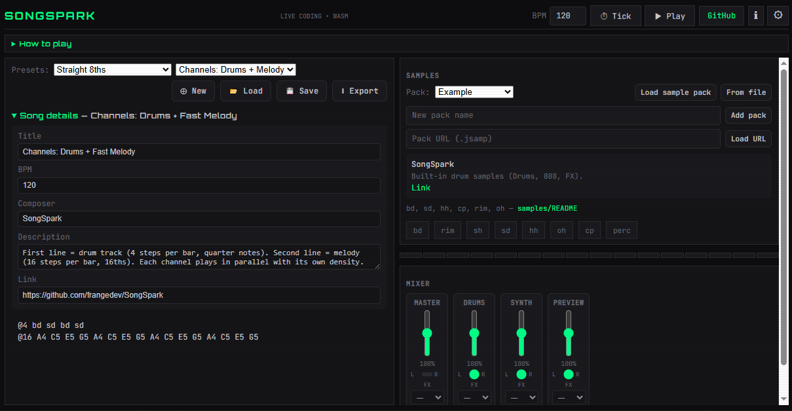

# SongSpark

SongSpark is an open-source, browser-based live coding platform for creating music through code. Built with Rust and WebAssembly, it aims for a **Strudel/TidalCycles**-style workflow: sound banks, pattern code, live control, and code-driven animation — all on one screen.



- **[Strudel](https://strudel.cc)** and **[TidalCycles](https://tidalcycles.org)** — same philosophy (live code, see what plays, comments). SongSpark uses a **simpler syntax**: space-separated tokens, `|` for same-time (parallel), `*n` to repeat, `//` or `#` for comments, and note names (A4, C#5) for the built-in synth. **Channels**: Multiple lines = multiple tracks. Start a line with `@N` for steps per bar (`@4` = quarter notes, `@16` = 16ths), so you can have simple drums on one line and a fast melody on the next.
- **Sound banks**: Multiple packs (e.g. Live drum, Techno), or **load a bank from URL** (JSON: `bankName`, `baseUrl`, `samples`). Drum names: bd, sd, hh, cp, rim, oh, cr, rd (see `samples/README.md`). **Drum loop from code**: Add a loop to a pack with a name (e.g. `loop`), select the pack, then type that name in the pattern (e.g. `loop bd sd hh`).
- **Presets** from `examples/presets.json`; **Songs** from the examples dropdown (drums-only and **synth + drums**); **Play** / **Spacebar**; **step strip** and **visualizer** driven by BPM/pattern (code-driven animation).
- **Roadmap**: Richer mini-notation, Web MIDI out to control devices, more sampler effects.

## Features
- **Live Coding**: Write code and hear music instantly in your browser.
- **Simple Syntax**: Write patterns like `bd sd hh`, `bd|A4` (drums + synth together), and `A4 C5 E5` (notes); use `|` for parallel and `*n` for repeat.
- **High Performance**: Powered by Rust and WebAssembly for low-latency audio.
- **Customizable Effects**: Add effects like gain or panning to shape your sounds.
- **Cross-Platform**: Runs in any modern browser with no dependencies.
- **Open Source**: MIT-licensed, welcoming contributions from the community.
- **Single-screen layout**: Everything fits in one viewport; collapsible help.

## Installation
SongSpark runs in the browser, but you can build and host it locally for development.

### Prerequisites
- [Rust](https://www.rust-lang.org/tools/install) (stable)
- [Trunk](https://trunkrs.dev/) for WebAssembly bundling
- **WASM target** (required to build for the browser)
- A modern web browser (Chrome, Firefox, Edge)

### Steps
1. Clone the repository:
   ```bash
   git clone https://github.com/frangedev/SongSpark.git
   cd SongSpark
   ```
2. Install the WebAssembly target (required once per machine):
   ```bash
   rustup target add wasm32-unknown-unknown
   ```
3. Install Trunk:
   ```bash
   cargo install trunk
   ```
4. Build and serve:
   ```bash
   trunk serve
   ```
5. Open `http://localhost:8080` in your browser to start coding music.

**If `trunk` fails with `invalid value '1' for '--no-color'`**, unset the env var and retry:
   ```bash
   # PowerShell
   Remove-Item Env:NO_COLOR -ErrorAction SilentlyContinue; trunk serve
   ```

## Sample files (where to get sounds)

How to add your own samples in the app:

1. In the app, use **“Add samples”** (right panel) and choose WAV or MP3 files.
2. Name your files so the built-in examples work: **bd** (bass drum), **sd** (snare), **hh** (hi-hat), **cp** (clap). For example: `bd.wav`, `sd.wav`, `hh.wav`, `cp.wav`.
3. See **[samples/README.md](samples/README.md)** for sample packs, required file names (bd, sd, hh, cp), and step-by-step “how to play”.

## Usage

1. **Open the Web App**: Run `trunk serve` and open `http://localhost:8080` (or your hosted URL).
2. **Add sample packs**: Create packs (e.g. Live drum, Techno) in the **Samples** panel, then upload WAV/MP3. Click “Choose audio files…” in the **Add samples** panel and select your drum one-shots (e.g. `bd.wav`, `sd.wav`, `hh.wav`, `cp.wav`).
3. **Choose a pattern**: Use the **Presets** dropdown or the example chips (e.g. “Basic beat”, “Four on the floor”), or type in the editor: `bd sd hh*2 cp`. Use `*n` to repeat (e.g. `hh*4`).
4. **Play**: Click **Play** or press **Spacebar** to play/stop.
5. **Save / Export**: **Save** downloads a JSON session; **Export MIDI** downloads the current pattern as MIDI.

### Pattern syntax (in the editor)

- `bd sd hh` — one kick, one snare, one hi-hat.
- `bd sd hh*2 cp` — kick, snare, hi-hat twice, clap.
- `bd bd sd bd hh*4` — two kicks, snare, kick, hi-hat four times.

## Project Structure
- `src/`: Rust source code for the core logic, audio engine, and Yew frontend.
- `index.html`: Entry point for the WebAssembly app; copies `examples/`, `samples/`, and `packs/` into the build (no separate static folder).
- `examples/`: **Presets** (`presets.json`) and **song examples** (`.jsong` files). Load shows only **code** in the editor; title/BPM/composer/description appear in “Song info”.
- `samples/`: Your WAV/MP3 files and `samples/README.md` (how to play, file names bd/sd/hh/cp).
- `packs/`: **Sample packs** (`.jsamp` files, e.g. `example.jsamp`) for “Load from URL” or “Load pack from file”. Keeps pack files distinct from song files (`.jsong`).
- `Cargo.toml`: Rust dependencies and build configuration.

## Contributing
We welcome contributions! To get started:
1. Fork the repository.
2. Create a branch (`git checkout -b feature/your-feature`).
3. Commit changes (`git commit -m "Add your feature"`).
4. Push to your branch (`git push origin feature/your-feature`).
5. Open a pull request.

Please follow [Code of Conduct](CODE_OF_CONDUCT.md) and check [issues](https://github.com/frangedev/SongSpark/issues) for ideas.

## License
SongSpark is licensed under the [MIT License](LICENSE).

## Acknowledgments
- Inspired by [Strudel](https://strudel.cc) and [TidalCycles](https://tidalcycles.org).
- Built with [Rust](https://www.rust-lang.org), [Yew](https://yew.rs), and [cpal](https://crates.io/crates/cpal).
- Thanks to the open-source community for feedback and inspiration.

Happy coding, happy music-making!
